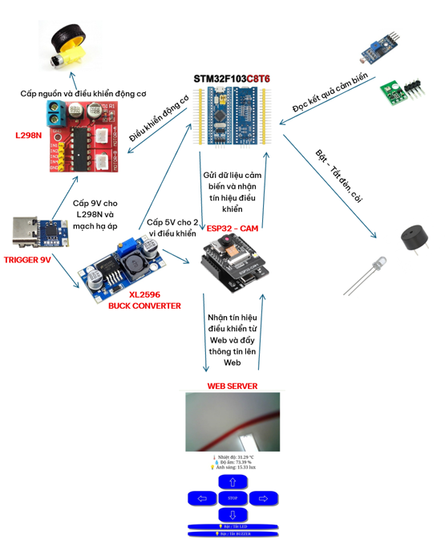
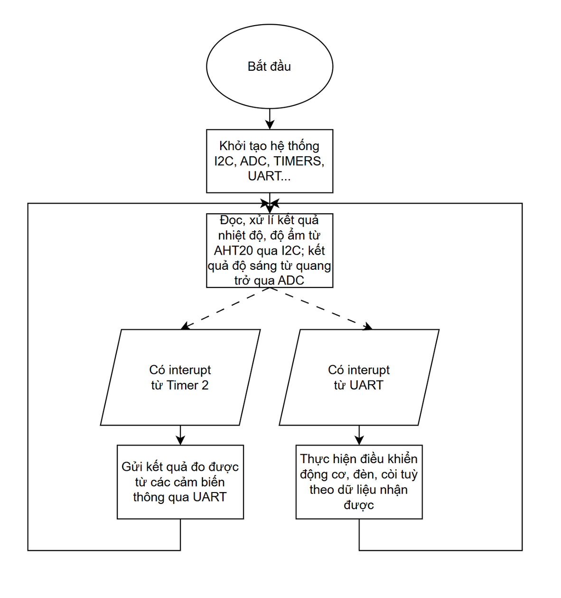
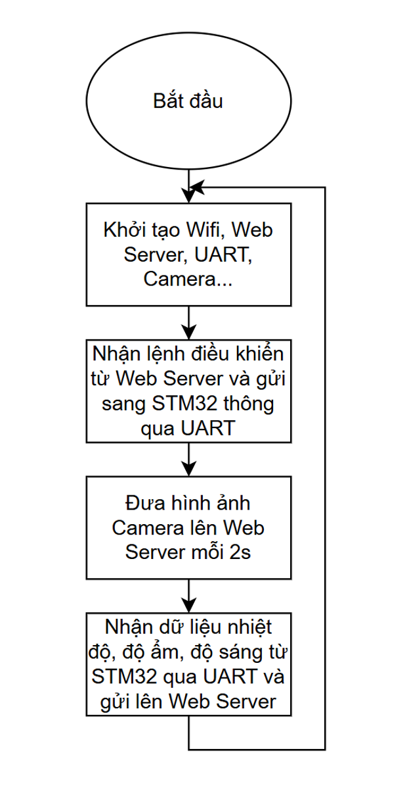
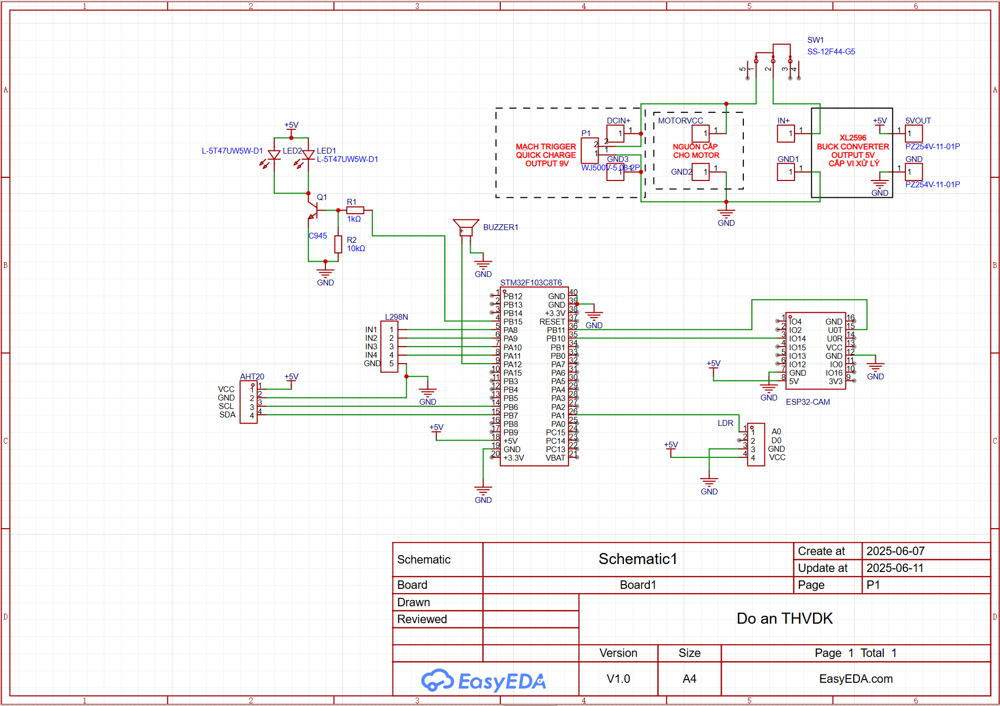
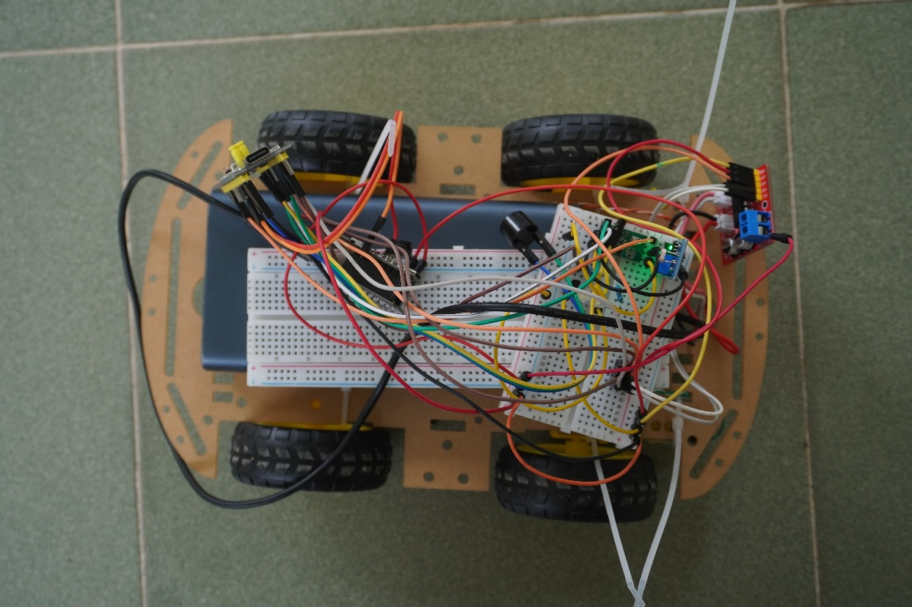
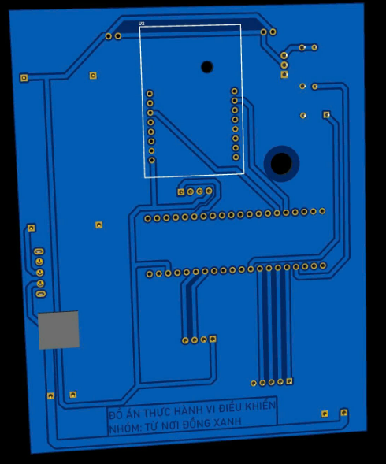
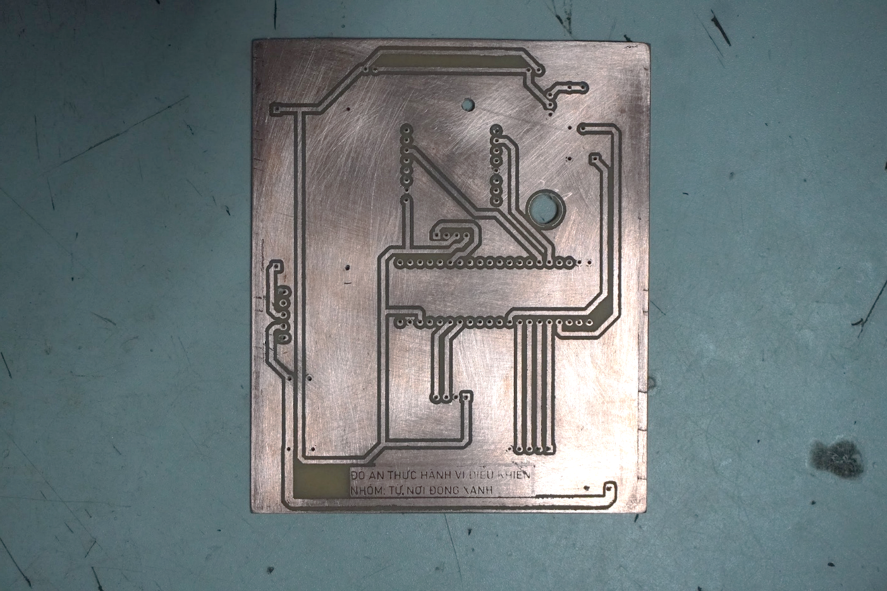
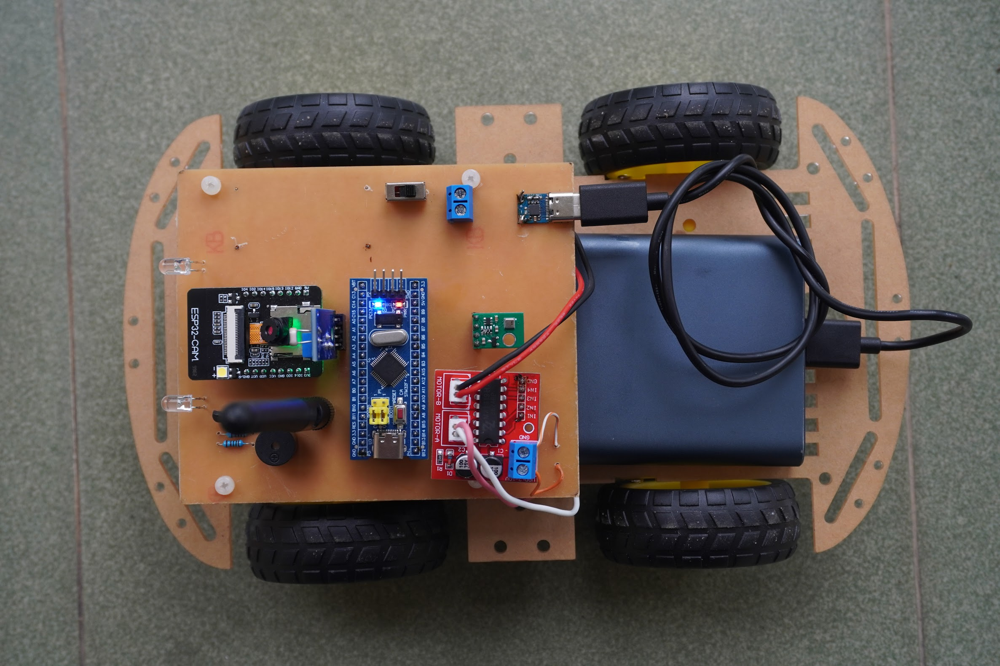
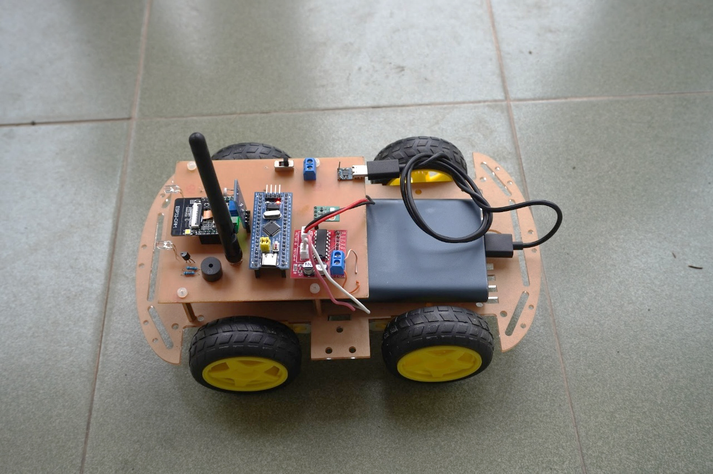
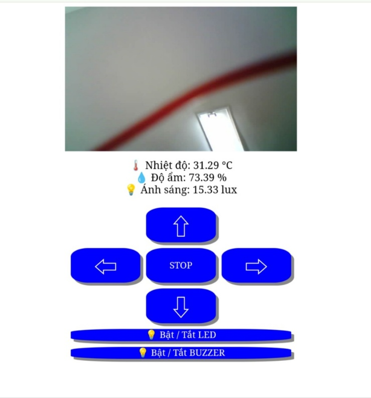

### Giới thiệu, đóng góp của bản thân trong dự án

Đề tà&#x69;**&#x20;“xe điều khiển thăm dò” -&#x20;**&#x74;hiết kế mô hình xe điều khiển bằng Wifi trên Web server, có trang bị bánh xe cao su phù hợp chạy trên môi trường bằng phẳng. Đồng thời trang bị thêm các cảm biến nhiệt độ, độ ẩm, ánh sáng và camera từ ESP32-Cam. Kết quả đọc giá trị sẽ được đọc theo chu kỳ và trả về web server. Người sử dụng có thể quan sát, điều khiển xe, đọc và đánh giá các giá trị đo được từ môi trường mà không cần tiếp cận quá gần. Trong dự án này, bản thân đảm nhận vai trò thiết kế đưa ra định hướng phát triển từ ý tưởng ban đầu, viết mã nguồn chính cho chương trình, thiết kế PCB và lắp đặt sản phẩm.

### Thiết kế sơ đồ khối cho dự án



### Sơ đồ giải thuật

***Trên STM32F103C8T6***



***Trên ESP32***



### Sơ đồ mạch



### Thiết lập UART để giao tiếp giữa ESP32 và STM32

Thiết lập thông số giao tiếp UART (Set UART Communication Parameters) cho ESP32-Cam. Trong đồ án này, sử dụng thông số đơn (Single Step). Vì Serial mặc định của ESP-32 dùng để nạp chương trình, vì thế chân RX không thể sử dụng một cách ổn định (riêng chân TX thì vẫn có thể sử dụng), do đó ý tưởng sẽ là khởi tạo thêm một giao thức UART khác để nhận tín hiệu gửi từ STM32 về thông qua chân RX.

```cpp
    const uart_port_t uart_num = UART_NUM_2;
    uart_config_t uart_config = {
        .baud_rate = 115200,
        .data_bits = UART_DATA_8_BITS,
        .parity = UART_PARITY_DISABLE,
        .stop_bits = UART_STOP_BITS_1,
        .flow_ctrl = UART_HW_FLOWCTRL_CTS_RTS,
        .rx_flow_ctrl_thresh = 122,
    };
```

### Khởi tạo kết nối wifi với ESP32-Cam

-        Để đơn giản hoá quá trình kết nối, gỡ lỗi nên trong dự án lần này, ESP32-Cam sẽ được lập trình để tự tạo điểm truy cập riêng, không kết nối với mạng wifi khác bên ngoài

```cpp
const char* ssid     = "MCULabProject-Fetel@HCMUS";
const char* password = "TuNoiDongXanh";
IPAddress local_IP(192,168,1,1);
IPAddress gateway(192,168,1,1);
IPAddress subnet(255,255,255,0);
AsyncWebServer server(80);
void setup(void) 
{
WiFi.softAP(ssid, password);
WiFi.softAPConfig (local_IP, gateway, subnet);
…
```

### Đọc nhiệt độ, độ ẩm từ cảm biến AHT20

Cần thiết lập tốc độ đọc và chân giao tiếp I2C cho cảm biến cũng như thiết lập bộ đếm Timer và tần số để đọc dữ liệu từ cảm biến theo chu kỳ trên phần mềm STM32

```cpp
//Setup
void HAL_TIM_PeriodElapsedCallback(TIM_HandleTypeDef *htim)
{
 if(htim->Instance == TIM4)
 {
	// Set every 100ms
	T_100ms = 255;
 }
}
uint8_t AHT20_RX_Data[6];
uint32_t AHT20_tem_Raw;
uint32_t AHT20_hum_Raw;

float AHT20_Temperature;
float AHT20_Humidity;
uint8_t AHT20_TmpHum_Cmd[3] = {0xAC, 0x33, 0x00};
#define AHT20_ADRESS (0x38 << 1) // 0b1110000; Adress[7-bit]Wite/Read[1-bit]
uint8_t T_100ms = 255;
uint8_t AHT20_Switcher = 255;

HAL_TIM_Base_Start_IT(&htim4);
...
//Function
  while (1)
  {
	  if(T_100ms)
{
if(AHT20_Switcher)
{
HAL_I2C_Master_Transmit_IT(&hi2c1, AHT20_ADRESS, (uint8_t*)AHT20_TmpHum_Cmd, 3); /* Send command (trigger measuremetns) + parameters */
}
{
HAL_I2C_Master_Receive_IT(&hi2c1, AHT20_ADRESS, (uint8_t*)AHT20_RX_Data, 6); /* Receive data: STATUS[1]:HIMIDITY[2.5]:TEMPERATURE[2.5] */
}
if(~AHT20_RX_Data[0] & 0x80)
{
/* Convert to Temperature in °C */
AHT20_tem_Raw = (((uint32_t)AHT20_RX_Data[3] & 15) << 16) | ((uint32_t)AHT20_RX_Data[4] << 8) | AHT20_RX_Data[5];
AHT20_Temperature = (float)(AHT20_tem_Raw * 200.00 / 1048576.00) - 50.00;
/* Convert to Relative Humidity in % */
AHT20_hum_Raw = ((uint32_t)AHT20_RX_Data[1] << 12) | ((uint32_t)AHT20_RX_Data[2] << 4) | (AHT20_RX_Data[3] >> 4);
AHT20_Humidity = (float)(AHT20_hum_Raw*100.00/1048576.00);
}
AHT20_Switcher = ~AHT20_Switcher; /* Invert */
T_100ms = 0; /* Nulify */
}
...
```

### Đọc giá trị cảm biến ánh sáng bằng module quang trở LDR

```cpp
HAL_ADC_Start(&hadc1);
HAL_ADC_PollForConversion(&hadc1, 1000);
value = HAL_ADC_GetValue(&hadc1);
Vq=(value*3.3)/4096;
Rs=(10000*Vq)/(3.3-Vq);
Es=pow(10,log10(18000/Rs))*10;
```

### Điều khiển xe từ lệnh được gửi qua Web đến ESP32 và SMT32

Với mỗi lệnh điều khiển trên ESP32 sẽ là một ký tự được truyền qua UART tới STM32 theo bảng sau đây:

|                                                |                      |
| ---------------------------------------------- | -------------------- |
| **Lệnh được gửi qua UART từ ESP32 sang STM32** | **Ý nghĩa của lệnh** |
| w                                              | Xe đi thẳng          |
| a                                              | Xe đi sang trái      |
| s                                              | Xe đi lùi            |
| d                                              | Xe đi sang phải      |
| r                                              | Xe dừng lại          |
| q                                              | Bật còi trên xe      |
| e                                              | Tắt còi trên xe      |
| g                                              | Bật đèn trên xe      |
| f                                              | Tắt đèn trên xe      |

Để STM32 có thể nhận được lệnh truyền qua và thực thi cùng lúc, ta sử dụng Interupt UART (void HAL_UART_RxCpltCallback) và kiểm tra lệnh được gửi đến, từ đó sẽ bật tắt các chân GPIO thích hợp

```cpp
void HAL_UART_RxCpltCallback(UART_HandleTypeDef *huart)
{
	if(huart->Instance == USART3)
	{
		x = huart->Instance->DR;
if(x=='w')
		{
			HAL_GPIO_WritePin(GPIOA,GPIO_PIN_8,GPIO_PIN_RESET);
			HAL_GPIO_WritePin(GPIOA,GPIO_PIN_9,GPIO_PIN_SET);
			HAL_GPIO_WritePin(GPIOA,GPIO_PIN_10,GPIO_PIN_SET);
			HAL_GPIO_WritePin(GPIOA,GPIO_PIN_11,GPIO_PIN_RESET);
		}
		if(x=='s')
		{
			HAL_GPIO_WritePin(GPIOA,GPIO_PIN_8,GPIO_PIN_SET);
			HAL_GPIO_WritePin(GPIOA,GPIO_PIN_9,GPIO_PIN_RESET);
			HAL_GPIO_WritePin(GPIOA,GPIO_PIN_10,GPIO_PIN_RESET);
			HAL_GPIO_WritePin(GPIOA,GPIO_PIN_11,GPIO_PIN_SET);
		}
		if(x=='a')
		{
			HAL_GPIO_WritePin(GPIOA,GPIO_PIN_8,GPIO_PIN_SET);
			HAL_GPIO_WritePin(GPIOA,GPIO_PIN_9,GPIO_PIN_RESET);
			HAL_GPIO_WritePin(GPIOA,GPIO_PIN_10,GPIO_PIN_SET);
			HAL_GPIO_WritePin(GPIOA,GPIO_PIN_11,GPIO_PIN_RESET);
		}
		if(x=='d')
		{
			HAL_GPIO_WritePin(GPIOA,GPIO_PIN_8,GPIO_PIN_RESET);
			HAL_GPIO_WritePin(GPIOA,GPIO_PIN_9,GPIO_PIN_SET);
			HAL_GPIO_WritePin(GPIOA,GPIO_PIN_10,GPIO_PIN_RESET);
			HAL_GPIO_WritePin(GPIOA,GPIO_PIN_11,GPIO_PIN_SET);
		}
		if(x=='r')
				{
			HAL_GPIO_WritePin(GPIOA,GPIO_PIN_8,GPIO_PIN_RESET);
			HAL_GPIO_WritePin(GPIOA,GPIO_PIN_9,GPIO_PIN_RESET);
			HAL_GPIO_WritePin(GPIOA,GPIO_PIN_10,GPIO_PIN_RESET);
			HAL_GPIO_WritePin(GPIOA,GPIO_PIN_11,GPIO_PIN_RESET);
		if(x=='q')
				{
			HAL_GPIO_WritePin(GPIOA,GPIO_PIN_12,GPIO_PIN_SET);
				}
		if(x=='e')
				{
			HAL_GPIO_WritePin(GPIOA,GPIO_PIN_12,GPIO_PIN_RESET);
				}
		if(x=='g')
				{
			HAL_GPIO_WritePin(GPIOB,GPIO_PIN_15,GPIO_PIN_SET);
				}
		if(x=='f')
				{
			HAL_GPIO_WritePin(GPIOB,GPIO_PIN_15,GPIO_PIN_RESET);
				}
}
}
```

Với các chân GPIO 8, 9, 10, 11 được dùng để cấp tín hiệu cho 4 chân In 1, 2, 3, 4 trên L298N. Còn lại chân GPIO 12 đảm nhiệm vai trò còi báo và GPIO 15 đảm nhiệm vai trò đèn chiếu sáng.

### Giao tiếp với ESP32 để truyền dữ liệu nhiệt độ, độ ẩm, ánh sáng

**Tại STM32**: Mỗi 1 giây (dùng Timer Interrupt TIM2), STM32 sẽ gửi kết quả cảm biến thông qua UART với định dạng: “XX.XX,YY.YY,ZZ.ZZ” với X là nhiệt độ, Y là độ ẩm và Z là độ sáng.

```cpp
void HAL_TIM_PeriodElapsedCallback(TIM_HandleTypeDef *htim)
{
  if(htim->Instance == TIM2)
  {
	 	 HAL_GPIO_TogglePin(GPIOC, GPIO_PIN_13);
 		sprintf(temp,"%.2f,%.2f,%.2f\n\r",AHT20_Temperature,AHT20_Humidity,Es);
 		HAL_UART_Transmit(&huart3,temp , sizeof(temp), 1000);
  }
}
```

**Tại ESP32**: Đọc liên tục dữ liệu được gửi từ UART STM32 trong void loop(){}, tách dữ liệu nhận được thành các biến nhiệt độ, độ ẩm, cường độ sáng riêng biệt bằng các hàm strtok (hàm tách chuỗi từ delimiter) và atof (chuyển dữ liệu dạng string/char về float), đồng thời cập nhật lên web sau khi chuyển đổi.

```cpp
    const uart_port_t uart_num = UART_NUM_2;
    uint8_t rx_data[1000];
    char data[1000];
    int length = 0;
    ESP_ERROR_CHECK(uart_get_buffered_data_len(uart_num, (size_t*)&length));
    length = uart_read_bytes(uart_num, rx_data, length, 1000); //Đọc dữ liệu TX từ STM32 đưa tới
    if (length > 0) {
      sprintf(data,"%s",rx_data); //Chuyển dạng dữ liệu sang String
        char * data_address = (char*) data;
        char * token = strtok(data_address,","); //Cắt chuỗi string để lấy dữ liệu nhiệt độ trước dấu “,”
         temperature = atof(token); //Ép kiểu string sang float và gán biến
        token = strtok(NULL,","); ////Cắt chuỗi string để lấy dữ liệu độ ẩm sau dấu “,” đầu tiên
         humidity = atof(token); // Ép kiểu string sang float và gán biến
        token = strtok(NULL,","); //Cắt chuỗi string để lấy dữ liệu độ sáng sau dấu “,” thứ hai
      lightLevel = atof(token); //Ép kiểu string sang float và gán biến
     sensorData = "{\"temp\":" + temperature + ",\"hum\":" + humidity + ",\"light\":" + lightLevel + "}"; //Cập nhật dữ liệu lên WebServerQu
```

### Quá trình thử nghiệm thực tế, lắp đặt sản phẩm cuối cùng


